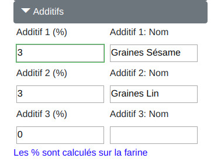
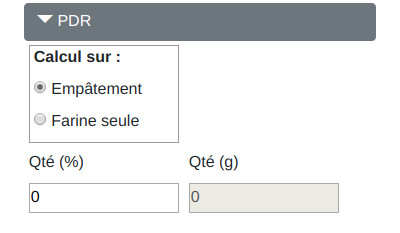

# RafCalc


## Présentation

**RafCalc** est un Web calculateur à pizza, développé en Blazor WebAssembly avec VSCode.

Ce dépot ne contient que les sources. Pour exécuter l'application, deux serveurs de pages statiques sont disponibles:

[Rafbor42.github.io](https://rafbor42.github.io): v1.0.520.0
[RafCalc.surge.sh](https://rafcalc.surge.sh/): v1.1.412.0

**Attention**: le code de ce dépot n'est pas en phase avec les pages publiées. N'ayant plus la volonté de poursuivre le développement, je mets les sources à disposition après avoir adapté le projet pour le framework .NET6.

## Fonctionnalités

Sur la page Calculateur, vous pouvez saisir la quantité et le poids des pâtons (jusqu'à 3 grammages différents), les taux d'hydratation, de sel et d'huile, ou saisir directement les quantités de chaque ingrédient en cochant 'Saisie directe des quantités'. Le bouton 'Appliquer les % sur la farine' appliquera sur la dose de farine renseignée, les impositions d'hydratation, de sel et d'huile définis.


Pour chaque pâton, il est possible d'utiliser le pré-calcul pour plaque de Teglia (long x larg / 2). Il suffit d'entrer les dimensions de la plaque en cm. On peut majorer ou minorer le poids en appliquant un coef +/- en %. Par exemple, pour une teglia plutôt épaisse, majorer de 20%.


Définition des horaires et des températures. Si les températures de pointage et d'apprêt sont différentes, le programme calcule une température moyenne en fonction des durées de chaque phase. Pour les heures de frigo, on considère que 1 h Frigo = 0,1 h TA.


On peut définir jusqu'à 3 phases TA ou Frigo pour le pointage et pour l'apprêt. Le total des heures de chaque phase doit correspondre aux heures définies dans la section Horaires-Températures.


Calcul des quantités et de la force moyenne d'un mélange de farines: renseigner les W de chaque farine et régler les % pour obtenir le W voulu, les quantités de farines apparaîtront dans les résultats du calcul.


Calcul de la dureté de l'eau, selon la formule de Pere153. Il est conseillé d'utiliser une eau moyennement dure, autour de 22°f. Cela peut être obtenu en coupant une eau dure avec une eau douce.

Renseigner les teneurs en calcium (Ca) et magnésium (Mg) ainsi que le nom de chaque eau
ajuster le % de l'eau 2 jusqu'à ce que la dureté du mélange soit voisine de 22°f
 Les pré-dosages sont intégrés pour Volvic-Vittel et Volvic-Evian.


Dans les Presets et Conversions:

* Possibilité de saisir les dosages par rapport à la farine.
* Possibilité d'imposer la dose de levure en cochant la case 'Preset Ldb'. Exemple pour imposer une dose de levure de 1g/lit: cocher 'Levure sur eau', saisir 1 g/lit, cocher 'Preset Ldb', le message 'Formule de calcul levure bypassée' apparaît, calculer: la dose de levure est calculée en fonction des 1g/lit.
* Gestion du type de levure (F)raiche ou (S)èche. Le résultat du calcul de la levure correspond par défaut à de la levure de bière fraîche. Si vous utilisez de la levure sèche, le résultat est divisé par le rapport LdbF / LdbS qui est positionné à 3 par défaut. A adapter (entre 2 et 3) en fonction de votre levure.


On peut ajouter jusqu'à 3 additifs. Une liste de noms est prédéfinie mais on peut saisir ce qu'on veut.



Calcul de la quantité de PDR (Pasta di Riporto ou Pâte Fermentée en français) sur l'empâtement total ou sur la farine. On ne tient pas compte du pouvoir levant de la PDR et on peut ainsi ajouter jusqu'à 100% de PDR.



Gestion de l'Autolyse, Biga et Poolish, avec un mode calcul automatique, qui propose les paramètres optimaux pour chaque technique:

* Conseil pour chaque technique: cliquer d'abord sur 'Calcul auto' puis changer les paramètres à sa convenance.
* Pour l'Autolyse, le calcul auto permet de choisir entre méthodes italienne (100% farine + 55% eau) et française (50% farine + 100% eau).
* Pour la Biga: le % de levure est mis sur 1% / farine avec Biga 100%. La durée de maturation conseillée est basée sur une interpolation linéaire des résultats de MasterBiga, ils sont légèrement supérieurs. En faisant varier hydrat et/ou température, la durée est réactualisée.
* Pour le Poolish, le calcul est basé sur les infos données par @Juju. En faisant varier la durée, le calcul est réactualisé.
* Pour Biga et Poolish, la levure de la recette est mise à 0 dans les presets, vous pouvez indiquer une valeur si vous souhaitez ajouter de la levure après la phase Biga ou Poolish.
* Les durées de pétrissage, pointage et apprêt à indiquer dans la recette, sont celles d'après la phase Autolyse, Biga, Poolish. Attention à bien vérifier le paramètre 'Preset Ldb' si vous abandonnez les calculs Biga ou Poolish, ou si vous mettez la durée à 0 (faire un Reset pour plus de sûreté).

Les valeurs ne sont pas prises en compte si aucune durée n'est précisée.


Insertion de notes.


Dans "Import-Export" vous pouvez soit charger une recette existante (déposée sur votre mobile ou dans le drive), soit la coller en passant par le presse-papier (Ctrl-C + Ctrl-V). Après avoir cliquer sur 'Générer recette', le bouton 'Sauvegarder' devient actif. Il n'est pas possible de sélectionner le dossier de destination, le fichier est téléchargé dans le dossier Download. Le nom du fichier par défaut est celui indiqué dans 'Nom recette'.


Dans le menu de navigation, la page 'Conseil maturation' donne des recommandations de durée de maturation d'après les formules de Japi. Utile quand on débute ou quand on veut tester une nouvelle farine.


### Conseil d'utilisation à TA pour les débutants:

Déterminer les heures de maturation en fonction de votre farine: dans la page 'Conseil maturation', saisissez la force (W) de votre farine ou son taux de protéines. La durée mini de maturation est indiquée (ex. pour W=300, durée mini=16h)
Dans la recette, répartir les heures sur les phases de pointage et d'apprêt: pour une TA de 19°C, privilégier un apprêt long (9-10h), pour une TA plus haute, on peut réduire l'apprêt, jusqu'à 4-5h en été.

### Formules de calcul de la levure utilisées (imaginé par @Daiconan et optimisé par @Japi)

```text
Japi1: LB= f*c*(1+s/200)*(1+o/300)/((-80+4,2*i-0,0305*i^2)*(g*t)^1,2)
Japi2: LB= f*c*(1+s/200)*(1+o/300)/((-80+4,2*i-0,0305*i^2)*(g^2,5)*(t^1,2))
LB = grammi lievito di birra fresco
f = grammi di farina
i = idratazione “alla pizzaiola” ovvero acqua/farina*100
g = gradi °C a cui avviene la lievitazione
t = tempo in ore
s = sale in grammi per litro
o = olio/strutto/burro in grammi per litro
c = coefficiente (Japi1=57,5; Japi2=2250)
```

## Ressources utilisées

[Bootstrap](https://getbootstrap.com/)
[Open Iconic](https://useiconic.com/open)
[SpinKit loading page](https://tobiasahlin.com/spinkit/) de Tobias Ahlin.
[BlazorFileSaver](https://github.com/IvanJosipovic/BlazorFileSaver) de Ivan Josipovic.
[BlazorOnGithubPages](https://github.com/SteveSandersonMS/BlazorOnGitHubPages) de Steve Anderson.

## Notes de version

* **1.2.0102.0**
    Première publication du code source.
    Framework cible: .NET6
